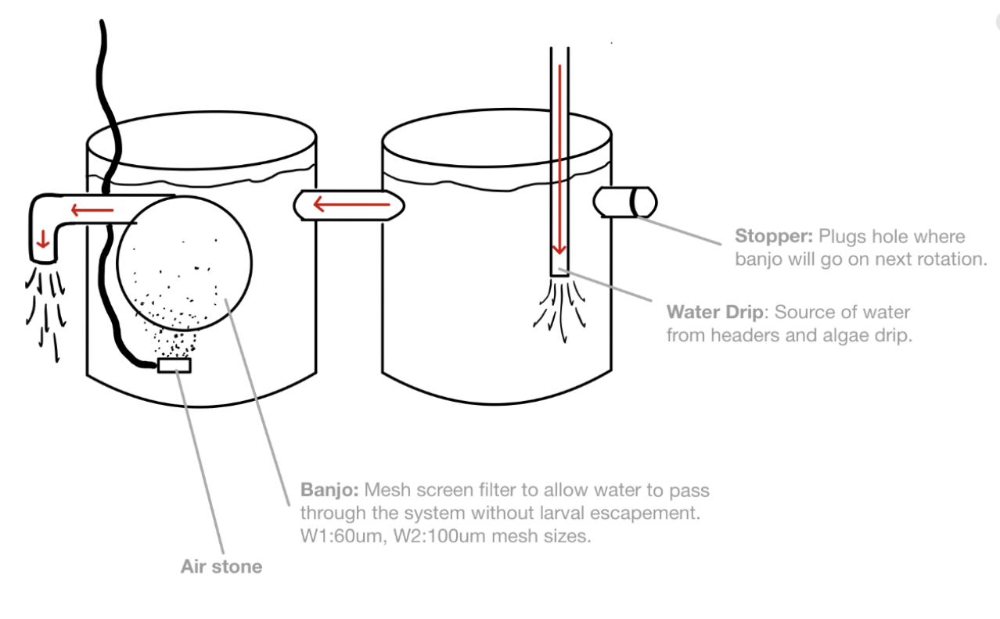
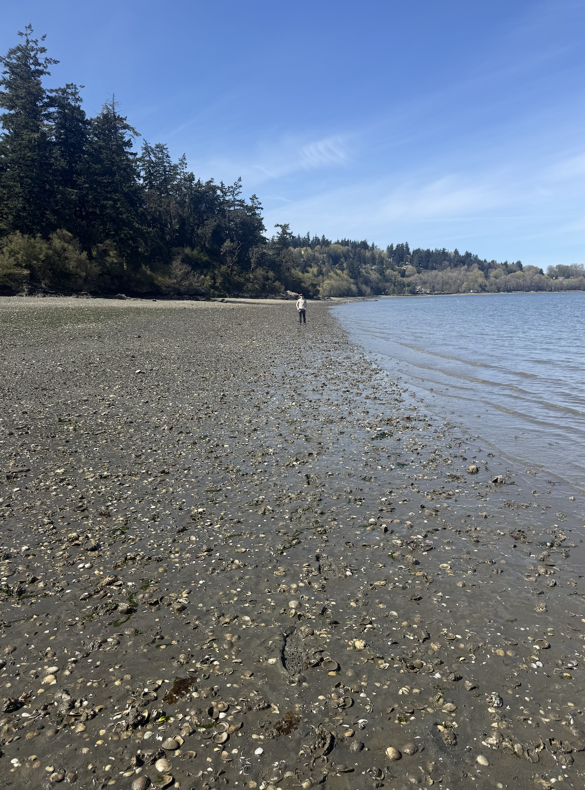

A brief recap on the cockle work so far, since I didn't post in march:

### **March 23: Cockle Broodstock Collection**

Cockles retrieved from Sequim Bay State Park. 115 of the largest individuals (\~100-125 mm) were selected for broodstock.

Broodstock was split into 4 groups (as part of the SeaGrant project investigating rates of selfing depending on broodstock abundance/non-self gamete availability):

-   A: n = 10

-   B: n = 15

-   C: n = 30

-   D: n = 60

Broodstock were brought to Manchester Research Station (bld 6) and transferred to tanks with flow-through seawater (filtered to 20 um) at 12C.

### **March 26: Cockle Spawning**

*I was not present for the cockle spawn but am reporting it here to set the basis for the larval rearing setup*

Cockle broodstock spawned naturally (ie., no reproductive conditioning) sometime between the evening of 3/25 and the morning of 3/26. The water in the broodstock tanks was trained through a 48 um mesh sieve to capture larvae. Larvae were transferred (by group) to two-sided larval tanks (see diagram).

There are 8 of these setups: 2 replicates for each of the 4 broodstock groups (16 tanks total)

To limit "clogging" of the banjo screens, an additional 5 um seawater filter in added to the water source for the building. Both the 20 um and the 5 um filters are washed daily with freshwater and fully replaced approximately 1x weekly.

### **March 31: Cockle Larvae Husbandry**

Water drip was shutoff and right (stopper-side) tanks had water drained via siphon through a 60 um sieve (to capture any larvae present in the tank).

Stopper was transferred to left tank (banjo-side) to limit spillover into draining tank.

Once right tank was empty, it was disconnected from the left tank, rinsed, washed with a vortex-freshwater solution, rinsed, and reconnected to the left tank.

Once reconnected, the banjo was replaced with a stopper in the left tank, removed, inspected visually to confirm no larvae present/stuck on mesh surface, and then rinsed, washed with the vortex solution, rinsed, and connected to the right tank to the interior side of the bulkhead that previously had the stopper. The airstone is also moved over to the right tank.

The water drip is turned on and placed on high flow in the right tank until \~1/2 full. Once an acceptable amount of water has filled the tank, the drip is shutoff, hose is removed and cleaned with freshwater, and replaced but put into the left tank (now the banjo-free tank) on medium/low flow.

In essence, the tanks swap roles every day to facilitate each tank getting cleaned every-other day.

& a lil bit of clam chapter discussion revisions

& 460 class prep

### April 1: Clam Trials & Nursery/Field Planning

Re-exposure trials week 1: [See clam-trails specific notebook entries](https://meganewing.github.io/mewing-notebook/posts/projects/clamtrials.html). One of the water baths would not heat past 25C, despite being set to 34C for 6+ hours, so only the 36C group was exposed. 34C group exposure rescheduled to monday. Additional updates can be found in [Jesse Lowe's notebook](https://genefish.wordpress.com/author/jlowe50bd14a0c15/).

& researching nursery methods for clam seed & outplant methods for up to 1 yr

& Outplant project & footprint description \@ Fidalgo Bay write up for Samish Tribe

& 460 class

### April 2: Cockle Larvae Husbandry

Some of the banjos became clogged overnight between April 1 and April 2 by the algal feed, despite best efforts to limit algae header to containing only small (\<60 um). As a result, some of the larval escaped via tank overflow. To assess quantity and adjust the system to prevent this reoccuring, all 16 tanks were systematically drained through 60 um sieves to capture all larvae and get larval count estimates. Tanks, hoses, banjos, etc were all cleaned as described previously. Seawater input filters were cleaned, and algae drip hoses were also flused and cleaned.

There was a reduction in larval quantity enough to where replicate tank setups 1 & 2 could be combined as space was no longer a limiting factor of concern for the larvae. The shelving until that previously held half the tanks was cleaned and setup for broodstock holding where they may be transitioned in to reproductive conditioning pending batch 1 larval survivorship over the next 2 weeks.

& hatchery meeting

& 460 class prep

### April 3: 

Administrative catch up morning (responding to emails). Reached out to Jen Ruesink about beta regarding clam outplanting materials and got some strong recommendations.

& 460 prep (checking week 2 materials and student submissions for week 1 quizzes, reviewing lecture notes)

& 460 lecture followed by weekly planning meeting with Sarah and Jose

### April 4: 

Home depot run! Got some PetScreen and put together some sample clam boxes sewn together with fishing line. First one was definitely a little rough but with the help of a cardboard jig, subsequent boxes went a bit smoother. Once Jesse brings in the wider-diameter mesh samples, I should be able to make the lid just fine.

### April 5:

Went out to weaverling spit in Fidalgo Bay to assess substrate suitability for a second field site. It was a shell-sand mix, with a bit more mud in spots than I was hoping for. It seems the manilas that are already at that site are a bit further up tidal elevation (closer to 10' above MLLW) and were 2-6" deep.

{width="284"}

{width="284"}

### April 6

460 lecture prep & lecture

clam trial for repeat exposure to 34C, week 1. [notebook post here](https://meganewing.github.io/mewing-notebook/posts/projects/clamtrials.html)
