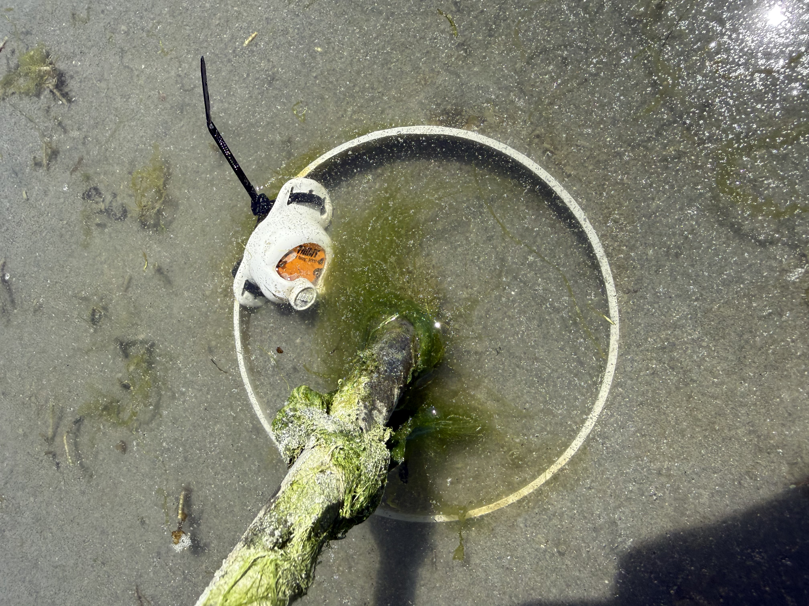
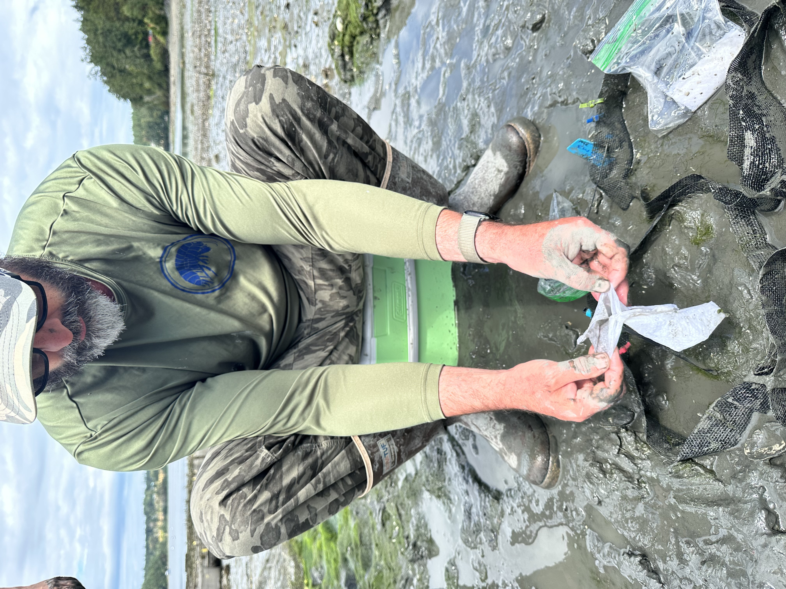
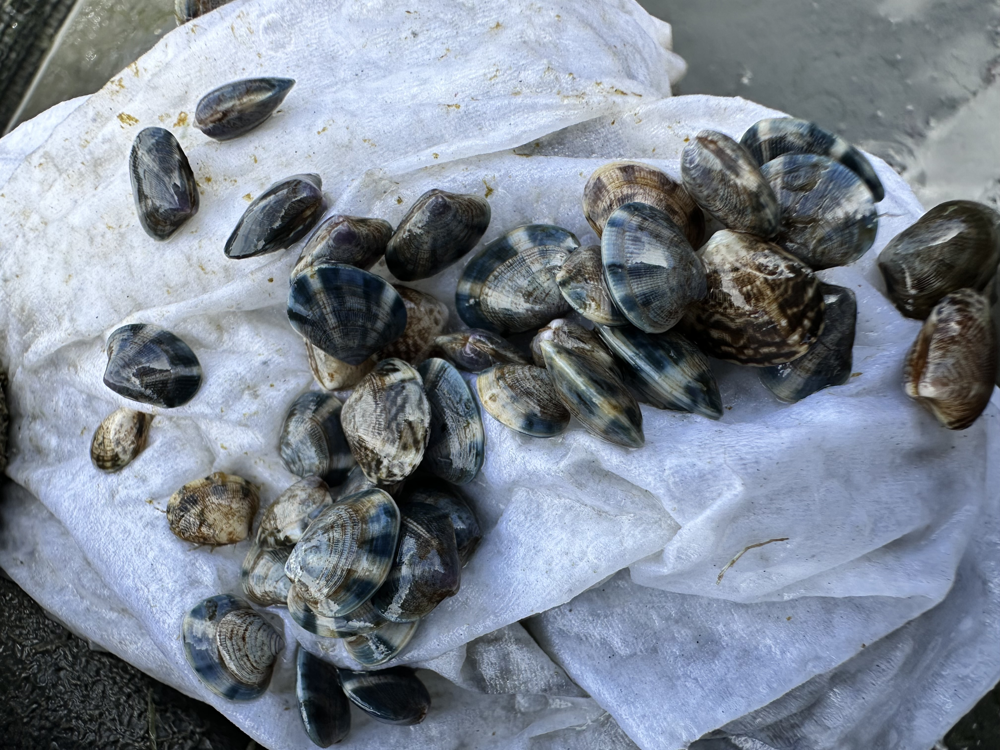
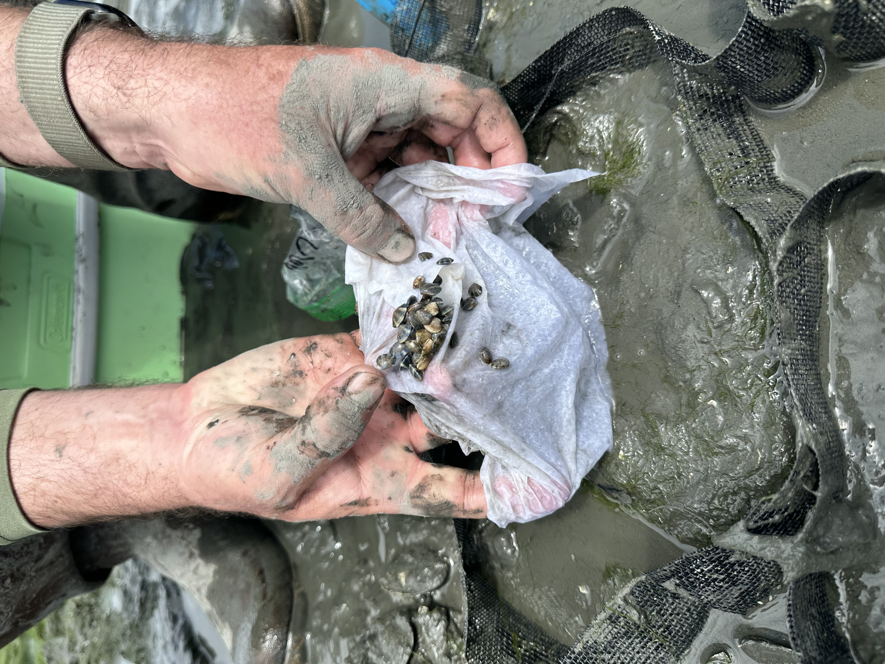
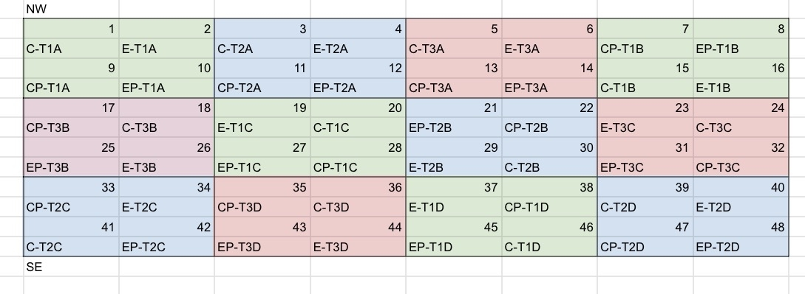
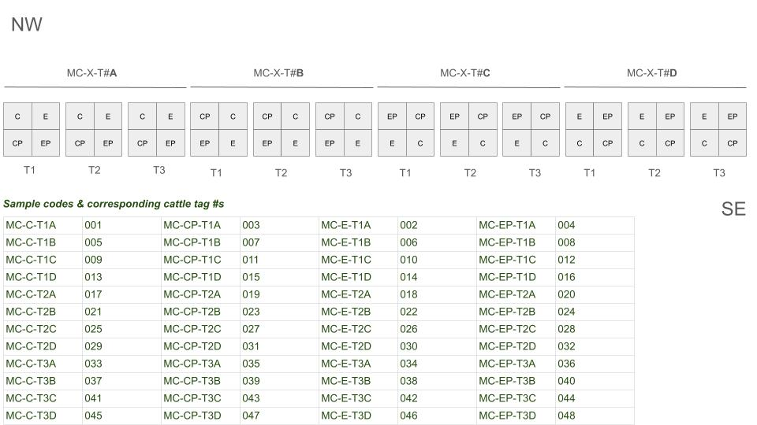
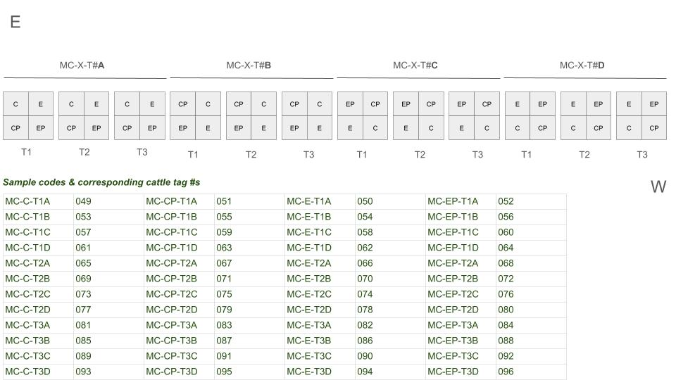

Deployed the clam and cockle seed this month! Agate pass (Suquamish) batches went out on Monday July 13th, and the Westcott Bay batch went out on Friday July 17th. Here are some pictures of the fun!

(photos taken by me unless otherwise specified)

### Agate Pass Suquamish Tribal Tideland - July 13th

*Basket Cockle Tubes: 6" dia. S&D PVC x 12" L. Driven \~6-8" into sand. Each seeded with 30 cockle seed (approx 2-4 mm). (photo credit: Grace Haaland)*

*It was a group effort seeding the tubes! Folks from PSRF and Suquamish tribe helped with our efforts. (Photo credit: Grace Haaland).*

*To track temperature the cockles are experiencing, we attached a hobo logger to a PVC tube and drove it down as-flush-as-possible to the sediment at the same tidal height and in same area of the sandbar as the cockles.*

*Jesse and Grace and I worked down to the wire to get the clams seeded in the clam boxes and covered in the predator-exclusion netting. There were 50 clams (\~5-7 mm) for each T1 & T2 box, and 30 clams for each T3 box. (Photo credit: Grace Haaland)*

*Grace and Jesse racing against the rising tide!*

*A clam box "4 pack"*

*We also deployed a hobo logger in the middle of one of the time point 3 "4 packs" for manila clams since they are at a different tidal elevation. The specific "4 pack" chosen is the T3 pack closest to the middle of all "4 packs" to get a "median" position relative to other clam boxes.*

*While we were out there and waiting for the tide to come in (so as to not have our seed baking in the sun too long), we helped PSRF and Suquamish Tribe with their first sampling event for their cockle tubes that were deployed 2 weeks prior.*

### Westcott Bay Shellfish Co. Tidelands - July 17th

*To install the clam boxes, Steven went ahead and dug out a 2'x2'x6" hole in 3' intervals. Jesse and I went in, added the clam boxes, and back filled them with the excavated sediment, with approximately 2-3" of the clam box exposed above the surface (\~3-4" buried). After they were all filled, Steven, Jesse, Hazel, and I went through and pulled out any live clams present (to the extent practicable) from each clam box before seeding. (Photo credit: Ariana Huffmyer)*

*We went through and seeded and tagged all the clam boxes – 50 clams per T1 and T2 box, 30 clams per T3 box. Zip ties color coded by treatment and numbered cattle tags added with black zip ties (Photo credit: Ariana Huffmyer)*

*Steven unwrapping the clams from their seawater-soaked paper towels they were transported in. (Transport bags organized by treatment, timepoint, and replicate). (Photo credit: Ariana Huffmyer)*

*Tiny little clams! (Photo credit: Ariana Huffmyer)*

*More tiny little clams about to experience sediment for the first time! (Photo credit: Ariana Huffmyer)*

*Hazel, Steven, and Jesse seeding the clam boxes. Oyster grow bags in the background and slightly lower tidal elevation (\~6' to the right of the clam boxes in the photo) is clam netting where Westcott Bay Shellfish Co. seeds and grows their manila clams.*

*Hobo logger added to the same "4-pack" (MC-XX-T3B) as agate site to log temp at westcott.*

*Once all the boxes were seeded, we covered them with their predator-exclusion netting and staked them down.*

### Deployment Layout

deployment layout is as follows for each species and site:

*Cockle tube deployment at agate pass. Number indicates tube number, and codes are sample codes (minus leading"BC-"*)

*Manila clam deployment at agate pass. Clam boxes are grouped in "4 packs" with each 4 pack having one replicate from each treatment. 3x 4 packs per replicate (1 per time point, per replicate). At approx +3' MLLW tidal elevation.*

*Manila clam deployment at Westcott Bay. At approx +3' MLLW tidal elevation.*

### Helping Hands & Thank Yous!!!

Huge thank you to everyone who helped with deployment efforts!!! It was not a light endeavor!

-   Jesse Lowe

-   Grace Haaland

-   Hazel-Abrahamson-Amerine

-   Amirah Casey

-   Jaycee Williford

-   Elizabeth Unsell

-   Misty Saigo

-   Ryan Crim

-   Ariana Huffmyer

-   Steven Roberts

-   Other folks at PSRF, Suquamish Tribe whose names I didn't catch :')

-   [The Suquamish Tribe](https://suquamish.nsn.us/) and [Westcott Bay Shellfish Co.](https://www.westcottbayshellfish.com/) who approved us deploying seed on their tidelands!!!
