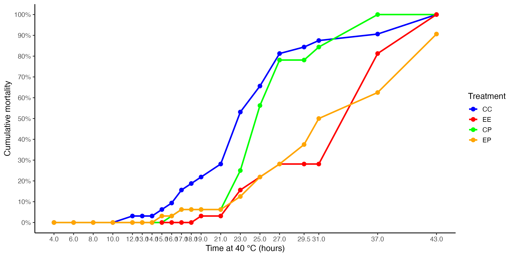
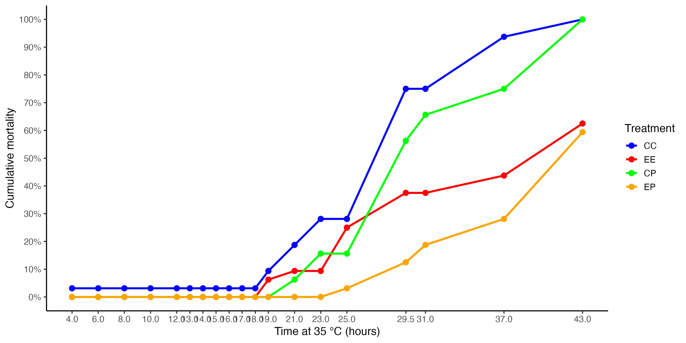
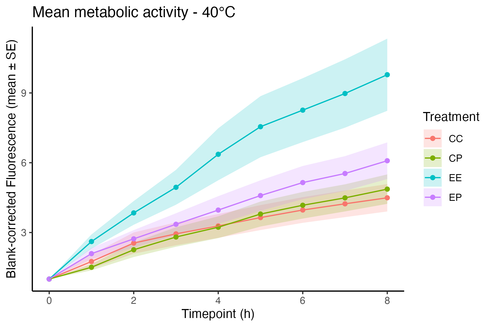
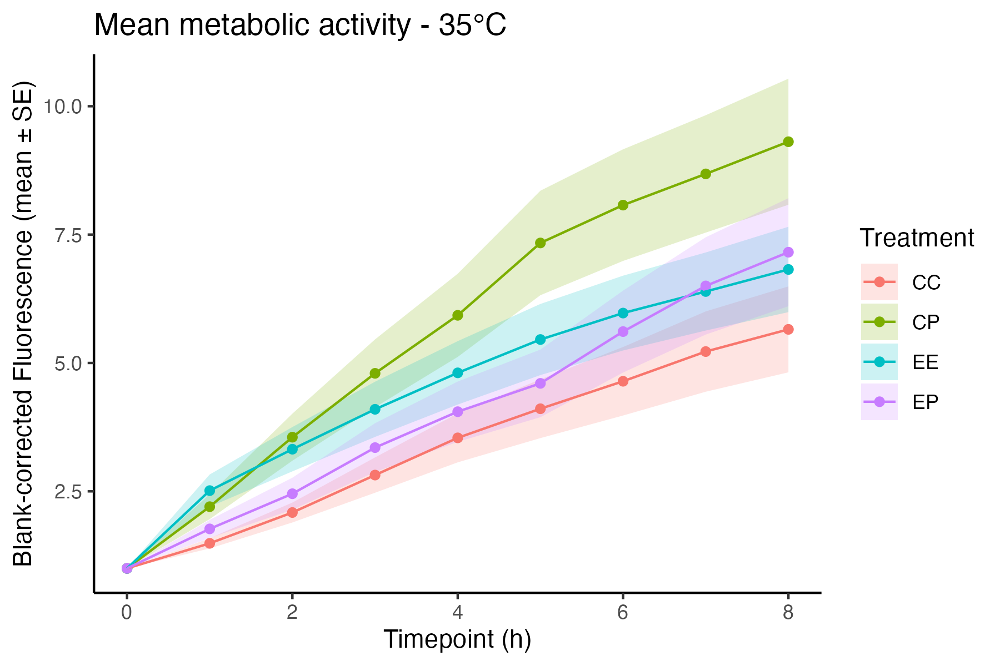
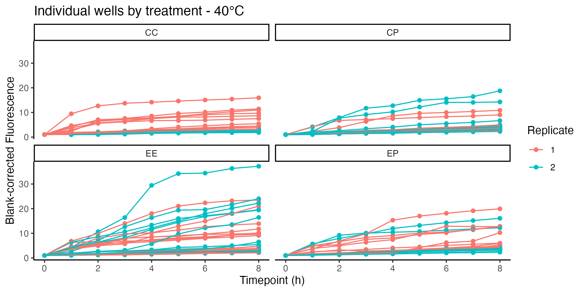
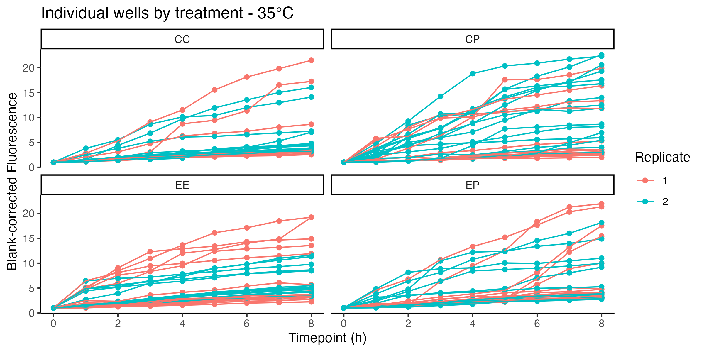
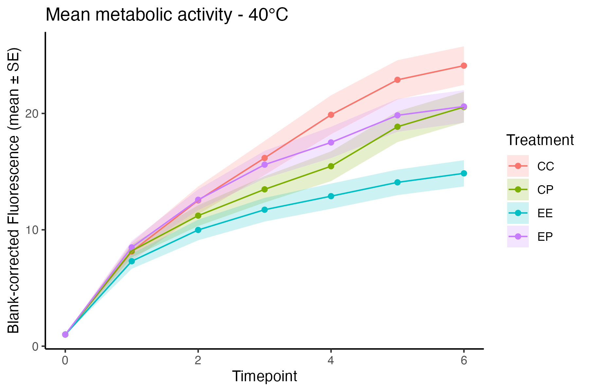
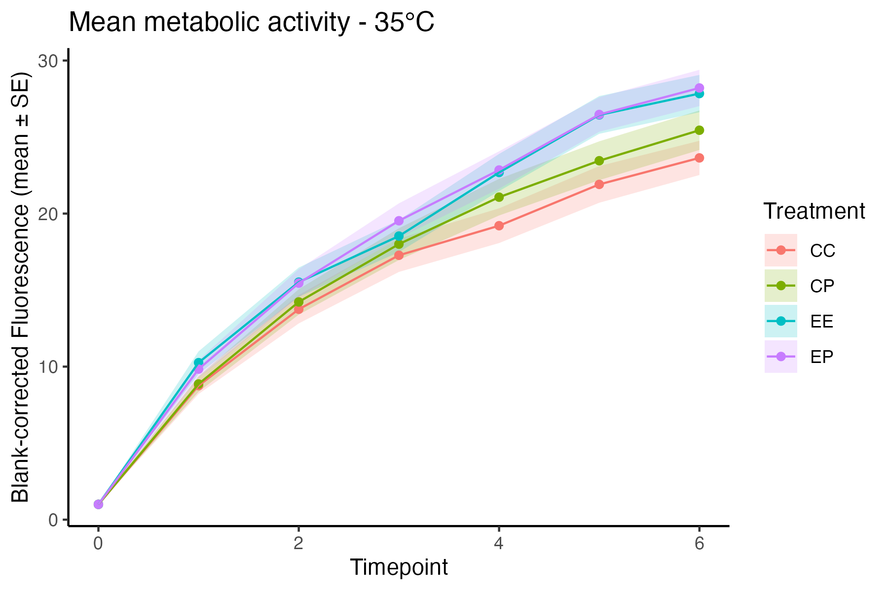
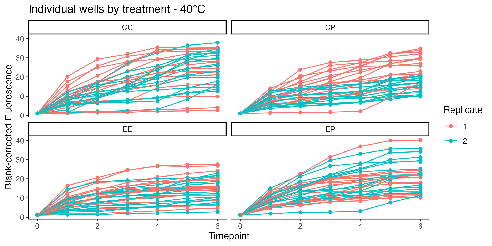
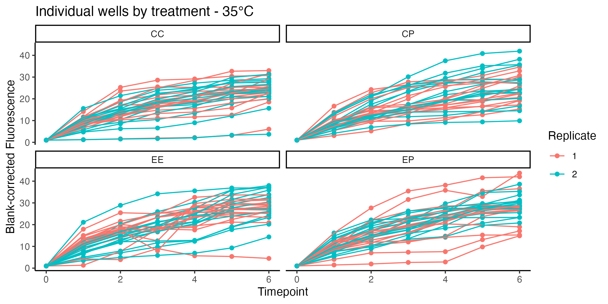

Prelim Results from Temp Reexposure Assays for 35C and 40C exposures of Lab Reared (LR) manila clams:

I'm heavily leaning towards doing 35C for the limited assay for the Agate Pass clams because that seemed to differentiate the Poly vs. no poly within temp groups a bit more.

The metabolic assays haven't been size normalize / AUC calculated yet, but here's the general vibe:

**Lab Reared:**

But the noise in the data makes it a little confusing:

**Here's the Westcott Clams:**

\^\^\^ this is the pattern I was expecting at 35C under my hypothesis and based under trials.

Here's the individual wells

Size wise, the Agate Pass are more similar to the Westcott Clams than the Lab clams, just based on visual estimates. So that further leans me towards doing 35C to see if the EP & EE having higher resp. at 35C holds true across sites...

[Repo here](https://github.com/meganewing/rphil_fieldprime)

(no readme yet, sorry)
