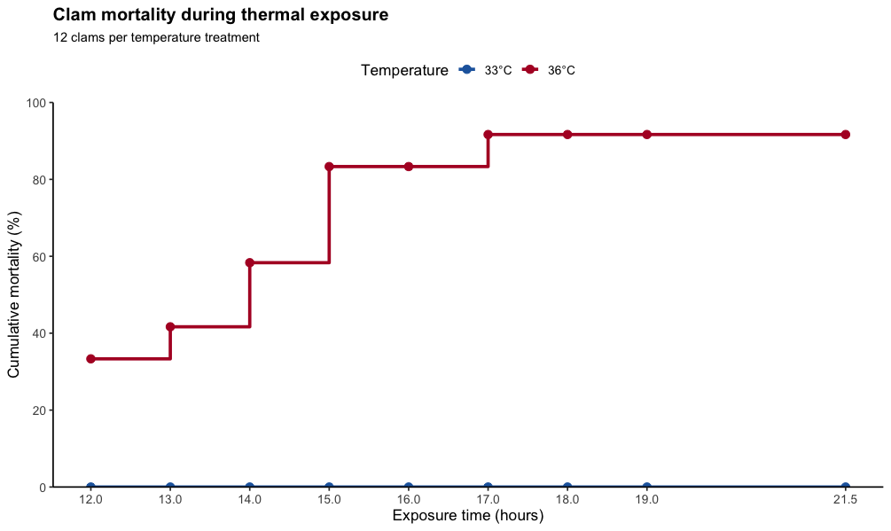
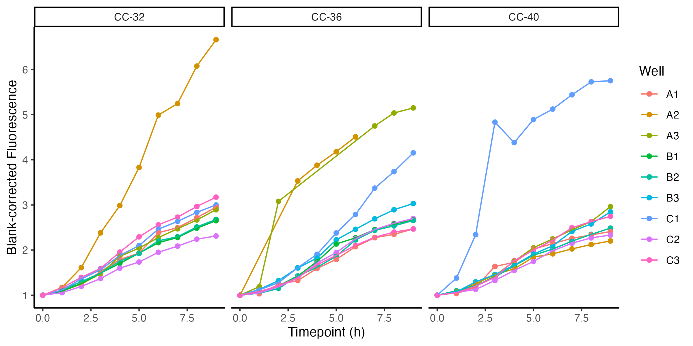

Went out and got the first batch of clams and cockles from both sites the past few days (8/09 westcott, 8/11 agate pass). Here are the rough counts (counted while in bags so may be off by 1 or 2):

-   Westcott Manilas

    -   Control Temp: n=134

    -   Elevated Temp: n=130

    -   Control + Poly: n=135

    -   Elevated + Poly: n=163

-   Agate Pass Manilas

    -   Control Temp: n=11

    -   Elevated Temp: n=19

    -   Control + Poly: n=20

    -   Elevated + Poly: n=32

-   Agate Pass Cockles

    -   Control Temp: n=39

    -   Elevated Temp: n=37

    -   Control + Poly: n=30

    -   Elevated + Poly: n=37

While the retrieval numbers for westcott were great, obviously the numbers for agate weren't quite as hoped...

### Prelim Assays

**Objective: Assess differences in survival and metabolism between primed and control groups under thermal stress.**

Pilot **survival assay** (n=12 per temp), observations from 12hr-21.5hr:

Pilot **resazurin assay** (n=9 per temp) showed the following (2.5hr at 25C followed by 4 hours at labeled temp):

[github repo here](https://github.com/meganewing/rphil_fieldprime) (see /test2 subdirs within code/ data/ and figures/)

### Assay Options 

#### **Option 1/"Plan A":** 

-   4 temps: 25C, 30C, 35C, 40C for manilas. 15, 20, 25, 30 for cockles

<!-- -->

-   n = 30 per temp

-   Procedure

    -   Put in treatment temp for 4hrs, measuring fluorescence every 30 min

    -   at the end of 4hrs, put in at-temp seawater in fresh well plate. check mortality hourly (or every 2hrs?) from 8-24hr

-   only possible for westcott manilas & lab clams and lab cockles

#### **Option 2:**

-   3 temps: 25C\*, 33C, 40C for manilas. 20\*, 25, 30 for cockles (\* = starting temp)

-   n (per temp) = 40 (lab manilas, westcott manilas, lab cockles), n = 15 agate cockles

-   Procedure

    -   put in starting temp for 4hr - readings every 30 min. after, put in fresh resazurin and at higher target temps (33&40 or 25&30) for 4 hours. readings every 30 minutes

    -   at the end of 4hrs, put in at-temp seawater in fresh well plate. check mortality hourly (or every 2hrs?) from 8-24hr

-   would be possible for westcott manilas, lab manilas, agate cockles, lab cockles

#### **Option 3 (super limited assay):** 

-   2 temps: 25C\* and 35C\* for manilas, 15\*, and 25C for cockles (\* = starting temp)

-   n (per temp) = 60 (lab manilas, westcott manilas, lab cockles), n = all :( for agate cockles and manilas

-   Procedure

    -   put in starting temp for 4hr - readings every 30 min. after, put in fresh resazurin and at higher target temps (33&40 or 25&30) for 4 hours. readings every 30 minutes

    -   at the end of 4hrs, put in at-temp seawater in fresh well plate. check mortality hourly (or every 2hrs?) from 8-24hr

-   Would be possible for all groups

#### **Option 4 (combination):**

-   Option 1 (Plan A) for groups that allow it (lab manilas, lab cockles, and westcott manilas).

-   Option 3 (limited assay) for for agate manilas and agate cockles

    -   "higher target temp" can be based on which temp showed the "peak" fluorescence

-   this would allow us to do a greater range of temperature testing for the groups that have the capacity to test them, and then using that information to selectively test a temperature for the groups that have reduced capacity.

    -   ie., we could glean "differences across a range of temperatures" for the lab groups + westcott manilas and "differences between treatments at a singular temperature" for the agate pass groups
