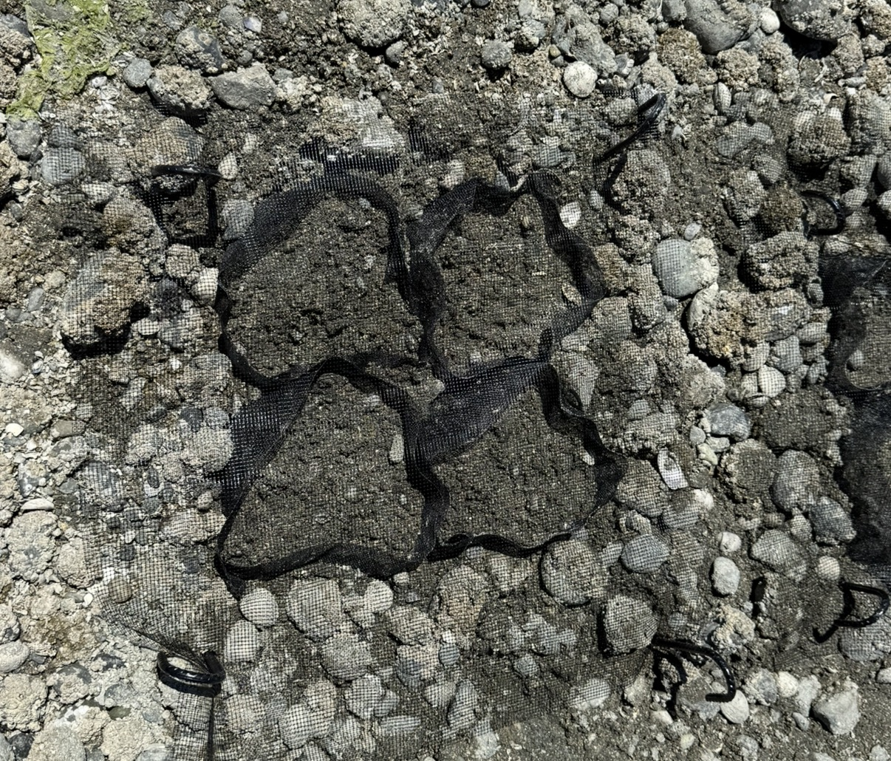
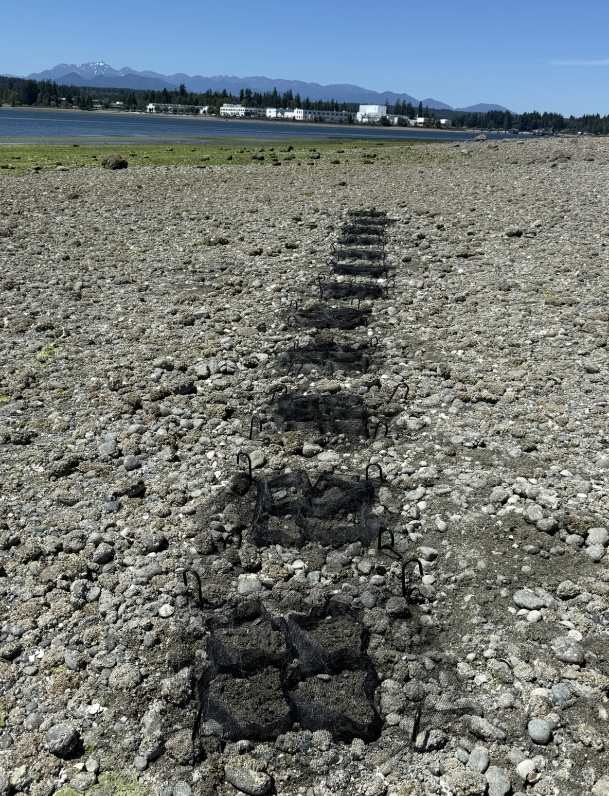

#### **Premise**

I am exposing (“priming”) Manila clam (*Ruditapes philippinarum*) seed (\~5 mm) to acute thermal and immune challenges 1x weekly for 4-6 weeks in a laboratory setting at UW prior to outplant to induce the physiological response that will serve as the basis for understanding their developed stress memory and potential for improved resiliency. This work will provide insights on the efficacy of thermal and immune priming on field performance (i.e. aquaculture setting applications of priming). 

#### **Priming and deployment**

Seed for both species will be held in closed-system recirculating artificial seawater tanks.  Priming experiments will consist of 2.5 hr exposures to ambient temperature water (10ºC) or elevated temperature water (34ºC), and with or without Poly(I:C) dosing (0.75ug/ml immersion bath). Priming will occur in aquaria separate from the rearing tanks once every 5 days, for 4 weeks (June 15th – July 10th). Following priming, seed will be placed in temporary holding tanks for 1hr to ensure Poly(I:C) is flushed from their tissues and shell surfaces prior to replacement into rearing tanks to prevent accidental trace dosing of tanks. No dosing will occur at least 48 hours prior to field site transfer. Seed will be transferred to two sites: Agate Pass (Suquamish Tribal Tidelands) and Westcott Bay (Westcott Bay Shellfish Co.) contained within marked grow boxes (10” x 10” x 5”, see images below) at approx. +3’ MLLW. 

*For Westcott Site:* I intend to outplant 48 mesh clam box setups for manila seed July 17th, 2026 during low tide. Boxes are made of UV-resistant pet screen (demonstrated to be a strong choice of material for containing manila clam sample groups in field applications by [Grason et al. 2024](https://doi.org/10.1155/2024/7411697)). A “4-pack” of clam boxes will be buried together (2 x 2 formation) in the sediment with a 2.25’ x 2.25’ square of clam netting (1/6" mesh size) staked at each corner with 16” J-hook rebar for gear securement and predator exclusion. Each "4-pack" will be placed at the same tidal elevation in a line with approx. 1’ between each pack, leading to an approximate 3’ x 2.25’ footprint per pack with 12 "4-packs" (48 individuals bags) total being deployed. Boxes will be labeled with treatment, lab, and contact information.

#### **Retrieval**

4 of the “4-packs” (16 individual clam boxes) will be retrieved at 4-weeks, 8-weeks, and 50-weeks post outplant and returned to UW for sample processing (including metabolic and survival assays under simulated heatwave conditions).

#### **Timeline**

-   July 17th, 2026: Gear Deployment and Outplant

-   August 10th-12th, 2026: Retrieval 1 (“4 week group”) & Gear Check

-   September 7th, 2026: Retrieval 2 (“8 week group”) & Gear Check

-   June 5th-7th, 2027: Retrieval 3 (final / “50 week group”)

#### **Footprint**

-   Approx. 35’ x 2’ of tidal land for the first 4 weeks. 

-   Approx 25’ x 2’ between weeks 4 and 8

-   Approx 15’ x 2’ for the overwinter group (weeks 8-50)

\^ One "4-pack" buried \~3" deep with \~2" of mesh exposed and clam netting staked over.

\^ 12 "4-packs" that have been deployed at the other field site, Agate Pass (Suquamish Tribal Tidelands).

#### Significance

This would be one of the first studies to assess the impact of priming on field performance in Manila clams and the first to assess long term (\> 3 months) field performance of primed clams. Priming in theory has strong potential for applications to improving aquaculture stock performance through increased growth and survival during adverse environmental conditions ([Tucci et al. 2025](https://doi.org/10.1016/j.isci.2025.113108); [Timmins-Schiffman et al. 2026](https://doi.org/10.1016/j.aquaculture.2025.743388)), however whether these effects can persist once growers outplant seed and if effects diminish over time remains to be seen. In addition to assessing strict field performance, the re-exposures within the lab will provide an opportunity to determine if the stress memory induced by priming persists to an extent that leads to improved outcomes in the face of climate anomalies (such as the 2021 Heat Dome) after being exposed to a field environment. Further, by looking across multiple time points, we can assess whether the impacts of priming diminish over time. In sum, this study will quantify the efficacy of priming on field performance, allowing suppliers and growers to make more informed decisions about whether the investment into a priming program is worth it for their practice.  
