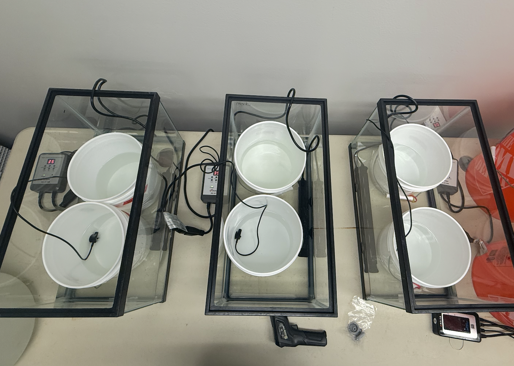
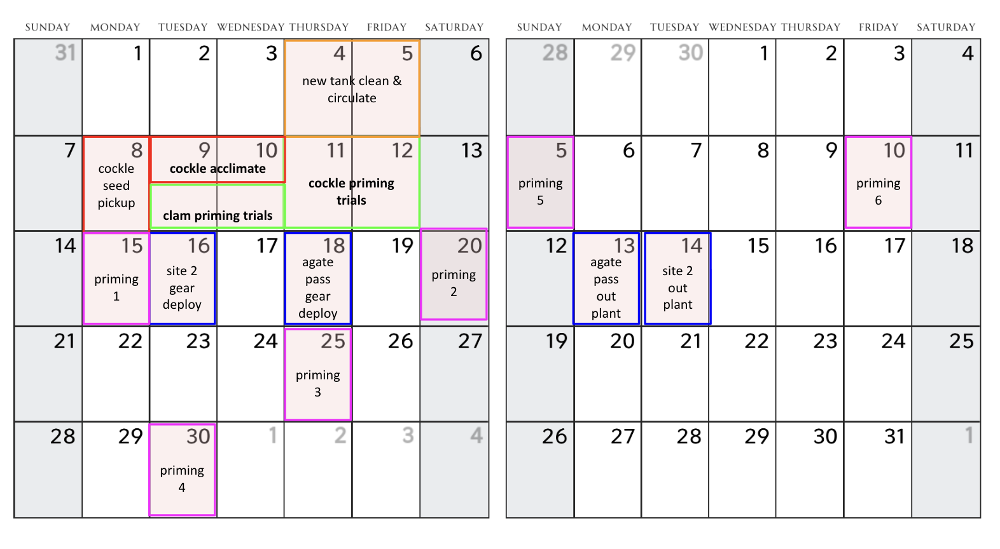

color coding key (zip ties):

-   pink = hot water

-   blue = cold water

-   yellow = poly(i:c)

### Warm temp priming

3 aquarium tanks setup with 2 buckets each.

-   1.5 L of water per white bucket (seawater). Don't put silos in yet (even empty silos) as it can affect bucket water heating

<!-- -->

-   Heating bar and temp gauge in each – heating bar in broader aquarium setup and temp gauge in the bucket.

-   Set temp on heater manager as desired, wait approx \~1 hr for water to heat, check temp and confirm bucket water temp with gun or glass thermometer.

-   Want Rphil tank buckets to be at \~34, want cockle buckets at \~30.

-   Once at temp, can place silos in their respective treatment buckets.

    -   in treatment buckets for 2h – check temp every 30 min w gun to confirm silo temp

### Cold temp priming

6 buckets setup on counter in tank room (no aquarium water bath needed)

-   1.5 L of water per white bucket (seawater). Don't put silos in yet

-   Check and record temp prior to placing silos

-   Once at temp and warm temp experiment has started, can place silos in their respective treatment buckets.

    -   in treatment buckets for 2h – check temp every 30 min w gun to confirm silo temp

### Poly(i:c) post bath

-   put poly(i:c) individuals in one of the yellow tanks post priming for \~30 minutes to allow them to flush the solution out, and then do a water change on that tank

\^ **June/July experimental logistics timeline**

### To do / next steps (as of 6/7):

-   figure out "shelf life" of poly(i:c) stock sol'n

-   calculate dosage for 1500ml (1.5L)

-   trial run with cockles and clams this coming week
