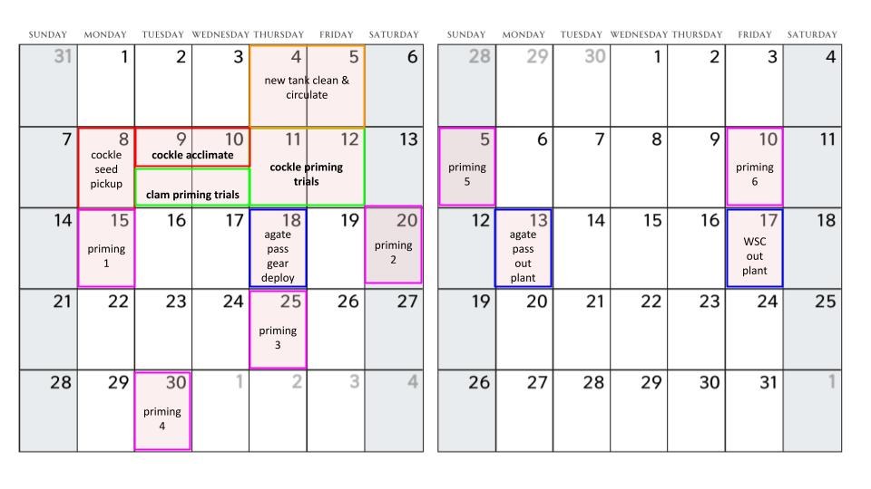

## Setup

color coding key (zip ties):

-   pink = hot water

-   blue = cold water

-   yellow = poly(i:c)

### Warm temp priming

4 aquarium tanks setup with 2 buckets each (2 replicates for each species / treatment).

-   Aquaria filled to \~4 cm deep with FW (marked with line on tank)
-   1240 mL of water per white bucket (30 ppt seawater). Don't put silos in yet (even empty silos) as it can affect bucket water heating
-   Heating bar and temp gauge in each – heating bar in broader aquarium setup and temp gauge in the bucket.
-   Set temp on heater manager as desired, wait approx \~1 hr for water to heat, check temp and confirm bucket water temp with gun or glass thermometer.
-   Want Rphil tank buckets to be at \~34C, want cockle buckets at \~25C.
    -   Initial trials and literature showed that Manila seed can tolerate \~38C before moralities occur. For the small cockle seed (2mm), there was 1 mortality in each of 2 pilot groups (group n=30) exposed to \~30C so I estimate they could handle 28-29C before a mortality would occur. As such, both priming temps are \~4C below maximum sub-lethal temp (this allows for a 2C margin of error for the temp gun and a 2C margin of error for the aquarium heaters).
-   For poly(i:c) groups: add 930 uL of Poly(I:C) solution (1mg/ml concentration) to each marked poly treatment bucket just prior (\~10 min) to pacing the silos in their treatment buckets.
-   Once at temp, can place silos in their respective treatment buckets.
    -   in treatment buckets for 2.5h – check temp one random silo (since all buckets are in same cold room / ie. exposed to exact same temp conditions) every 30 min w gun to confirm and record temp.

### Cold temp priming

8 buckets setup on counter in tank room (no aquarium water bath needed)

-   1240 mL of water per white bucket (30 ppt seawater). Don't put silos in yet

-   For poly(i:c) groups: add 930 uL of Poly(I:C) solution (1mg/ml concentration) to each marked poly treatment bucket just prior (\~10 min) to pacing the silos in their treatment buckets.

-   Check and record temp prior to placing silos

-   Once at temp and warm temp experiment has started, can place silos in their respective treatment buckets.

    -   in treatment buckets for 2.5h – check temp every 30 min w gun to confirm and record silo temp

### Recovery and Poly(i:c) post bath

-   at the end of the priming duration, transfer silos to the yellow tanks (\~10C) for 1 hr.
-   put poly(i:c) individuals in one of the yellow tanks post priming for \~60 minutes to allow them to flush the solution out, and then do a water change on that tank
    -   WQ is checked the morning of the experiment for both tanks to ensure recovery conditions are consistent across tanks
-   After recovery, put manilas and cockle silos are briefly rinsed (with seed in silos) and returned in their normal tanks as per usual. closely observe over the next 48 hrs

*\^ June/July experimental logistics timeline*

*\^ Rearing tanks (also resting tanks)*

**Code names:**

MC - Manila clam

BC - basket cockles

letter = replicate group / aquarium

\# = treatment silo within replicate group

**Silo Counts:**

MC-A1: 700

MC-A2: 700

MC-B1: 700

MC-B2: 700

MC-C1: 700

MC-C2: 700

MC-D1: 700

MC-D1: 700

BC-A1: 203

BC-A2: 297

BC-B1: 300

BC-B2: 298

BC-C1: 315

BC-C2: 315

BC-D1: 315

BC-D2: 315

## Priming Logs

### Prime 1 - 6/15/26

Tank setup:

|           |           |           |           |           |
|-----------|-----------|-----------|-----------|-----------|
|           | **MC-A**  | **MC-B**  | **BC-C**  | **BC-D**  |
| **Warm**  | Rep 2     | Rep 1 (P) | Rep 2     | Rep 1 (P) |
| Rep 1 (P) | Rep 2     | Rep 1 (P) | Rep 2     |           |
|           |           |           |           |           |
|           | **MC-C**  | **MC-D**  | **BC-A**  | **BC-B**  |
| **Cold**  | Rep 1     | Rep 1     | Rep 1     | Rep 1     |
| Rep 2 (P) | Rep 2 (P) | Rep 2 (P) | Rep 2 (P) |           |

Temp readings (ºC):

|  |  |  |  |  |  |  |  |
|---------|---------|---------|---------|---------|---------|---------|---------|
|  | **T0 Initial** | **T1** | **T2** | **T3** | **T4** | **T5 (Final)** |  |
| **Time (PST)** | **12:38** | **13:06** | **13:37** | **14:09** | **14:40** | **14:06** | **Average** |
| **MC-A1** | 30.9 | 33.7 | 33.1 | 33.1 | 32.5 | 33.1 | 32.7 |
| **MC-A2** | 30.2 | 32.8 | 32.6 | 32.3 | 32.2 | 32.7 | 32.1 |
| **MC-B1** | 31.6 | 33.1 | 32.5 | 32.6 | 32.4 | 33.0 | 32.5 |
| **MC-B2** | 32.0 | 33.5 | 32.6 | 33.0 | 32.4 | 33.0 | 32.8 |
| **BC-C1** | 26.9 | 28.1 | 27.8 | 27.6 | 27.6 | 27.2 | 27.5 |
| **BC-C2** | 27.5 | 27.8 | 27.5 | 27.6 | 27.5 | 27.3 | 27.5 |
| **BC-D1** | 27.2 | 28.1 | 27.8 | 27.6 | 27.5 | 27.7 | 27.7 |
| **BC-D2** | 27.5 | 28.2 | 27.8 | 27.7 | 27.5 | 27.6 | 27.7 |
| **Cold** | 10.5 |  |  |  |  |  |  |

**\*note: cold temp was not recorded at same intervals for this week. 1 temp was recorded at T3 (halfway)**

### Prime 2 - 6/20/26

tank setup:

|          |           |           |           |           |
|----------|-----------|-----------|-----------|-----------|
|          | **MC-A**  | **MC-B**  | **BC-C**  | **BC-D**  |
| **Warm** | Rep 1 (P) | Rep 2     | Rep 1 (P) | Rep 2     |
| Rep 2    | Rep 1 (P) | Rep 2     | Rep 1 (P) |           |
|          |           |           |           |           |
|          | **MC-C**  | **MC-D**  | **BC-A**  | **BC-B**  |
| **Cold** | Rep 2 (P) | Rep 2 (P) | Rep 2 (P) | Rep 2 (P) |
| Rep 1    | Rep 1     | Rep 1     | Rep 1     |           |

temp readings (ºC):

|  |  |  |  |  |  |  |  |
|---------|---------|---------|---------|---------|---------|---------|---------|
|  | **T0 Initial** | **T1** | **T2** | **T3** | **T4** | **T5 (Final)** |  |
| **Time (PST)** | **10:46** | **11:17** | **11:47** | **12:17** | **12:47** | **13:15** | **Average** |
| **MC-A1** | 31.3 | 32.1 | 32.0 | 32.2 | 32.1 | 32.2 | 32.0 |
| **MC-A2** | 31.4 | 34.0 | 33.7 | 33.2 | 33.5 | 33.1 | 33.2 |
| **MC-B1** | 32.0 | 33.8 | 34.2 | 32.8 | 34.4 | 33.5 | 33.5 |
| **MC-B2** | 32.0 | 33.9 | 33.7 | 32.5 | 33.9 | 33.3 | 33.2 |
| **BC-C1** | 26.0 | 25.4 | 25.2 | 24.2 | 24.8 | 23.1 | 24.8 |
| **BC-C2** | 26.5 | 25.8 | 25.4 | 24.5 | 24.1 | 23.7 | 25.0 |
| **BC-D1** | 27.1 | 26.9 | 26.0 | 25.2 | 24.1 | 23.6 | 25.5 |
| **BC-D2** | 27.1 | 26.6 | 25.7 | 25.1 | 23.8 | 23.6 | 25.3 |
| **COLD** | 10 | 10 | 9.9 | 10 | 9.4 | 9.8 | 9.85 |

### Prime 3 - 6/25/26

|  |  |  |  |  |  |  |  |
|---------|---------|---------|---------|---------|---------|---------|---------|
| **TANK SETUP** |  |  |  |  |  |  |  |
|  | **MC-A** | **MC-B** | **BC-C** | **BC-D** |  |  |  |
| **Warm** | Rep 2 | Rep 1 (P) | Rep 2 | Rep 1 (P) |  |  |  |
| Rep 1 (P) | Rep 2 | Rep 1 (P) | Rep 2 |  |  |  |  |
|  |  |  |  |  |  |  |  |
|  | **MC-C** | **MC-D** | **BC-A** | **BC-B** |  |  |  |
| **Cold** | Rep 1 | Rep 1 | Rep 1 | Rep 1 |  |  |  |
| Rep 2 (P) | Rep 2 (P) | Rep 2 (P) | Rep 2 (P) |  |  |  |  |
|  |  |  |  |  |  |  |  |
| **TEMP CHECKS (ºC)** |  |  |  |  |  |  |  |
|  | **T0 Initial** | **T1** | **T2** | **T3** | **T4** | **T5 (Final)** |  |
| **Time (PST)** | **8:34** | **9:05** | **9:35** | **10:06** | **10:36** | **11:04** | **Average** |
| **MC-A1** | 31.7 | 32.7 | 34.2 | 33.8 | 33.5 | 33.2 | 33.2 |
| **MC-A2** | 32.3 | 32.3 | 33.5 | 33.8 | 33.5 | 32.8 | 33.0 |
| **MC-B1** | 32.0 | 32.4 | 33.0 | 32.7 | 32.8 | 32.6 | 32.6 |
| **MC-B2** | 32.4 | 33.4 | 33.5 | 33.4 | 33.3 | 33.2 | 33.2 |
| **BC-C1** | 26.2 | 26.0 | 25.0 | 24.9 | 24.6 | 24.1 | 25.1 |
| **BC-C2** | 26.0 | 25.7 | 25.5 | 24.9 | 24.5 | 24.3 | 25.2 |
| **BC-D1** | 26.1 | 26.1 | 25.5 | 25.6 | 25.1 | 24.4 | 25.5 |
| **BC-D2** | 26.7 | 26.7 | 26.6 | 26.0 | 25.2 | 24.4 | 25.9 |
| **COLD** | 11.3 | 11.2 | 11.2 | 11 | 10.8 | 10.8 | 11.05 |

### Prime 4 - 6/30/26

|  |  |  |  |  |  |  |  |
|---------|---------|---------|---------|---------|---------|---------|---------|
| **TANK SETUP** |  |  |  |  |  |  |  |
|  | **MC-A** | **MC-B** | **BC-C** | **BC-D** |  |  |  |
| **Warm** | Rep 1 (P) | Rep 2 | Rep 1 (P) | Rep 2 |  |  |  |
| Rep 2 | Rep 1 (P) | Rep 2 | Rep 1 (P) |  |  |  |  |
|  |  |  |  |  |  |  |  |
|  | **MC-C** | **MC-D** | **BC-A** | **BC-B** |  |  |  |
| **Cold** | Rep 2 (P) | Rep 2 (P) | Rep 2 (P) | Rep 2 (P) |  |  |  |
| Rep 1 | Rep 1 | Rep 1 | Rep 1 |  |  |  |  |
|  |  |  |  |  |  |  |  |
| **TEMP CHECKS (ºC)** |  |  |  |  |  |  |  |
|  | **T0 Initial** | **T1** | **T2** | **T3** | **T4** | **T5 (Final)** |  |
| **Time (PST)** | **9:24** | **9:54** | **10:28** | **10:56** | **11:25** | **11:50** | **Average** |
| **MC-A1** | 31.3 | 32.4 | 32.2 | 31.7 | 32 | 32.2 | 32.0 |
| **MC-A2** | 31.8 | 33.4 | 33.0 | 32.8 | 32.8 | 32.8 | 32.8 |
| **MC-B1** | 30.7 | 33.1 | 33.8 | 33.6 | 33.5 | 33.9 | 33.1 |
| **MC-B2** | 31.1 | 32.3 | 32.3 | 32.5 | 32.6 | 33.0 | 32.3 |
| **BC-C1** | 24.5 | 24.0 | 23.3 | 22.8 | 26.3 | 25.1 | 24.3 |
| **BC-C2** | 25.4 | 24.5 | 23.6 | 22.9 | 26.1 | 25.3 | 24.6 |
| **BC-D1** | 25.5 | 24.4 | 23.8 | 22.8 | 25.2 | 25.3 | 24.5 |
| **BC-D2** | 25.4 | 24.3 | 23.5 | 22.3 | 25.0 | 25.7 | 24.4 |
| **COLD** | 9.5 | 9.8 | 9.9 | 9.5 | 9.8 | 9.6 | 9.7 |

### Prime 5 - 7/5/26

|  |  |  |  |  |  |  |  |
|---------|---------|---------|---------|---------|---------|---------|---------|
| **TANK SETUP** |  |  |  |  |  |  |  |
|  | **MC-A** | **MC-B** | **BC-C** | **BC-D** |  |  |  |
| **Warm** | Rep 2 | Rep 1 (P) | Rep 2 | Rep 1 (P) |  |  |  |
| Rep 1 (P) | Rep 2 | Rep 1 (P) | Rep 2 |  |  |  |  |
|  |  |  |  |  |  |  |  |
|  | **MC-C** | **MC-D** | **BC-A** | **BC-B** |  |  |  |
| **Cold** | Rep 1 | Rep 1 | Rep 1 | Rep 1 |  |  |  |
| Rep 2 (P) | Rep 2 (P) | Rep 2 (P) | Rep 2 (P) |  |  |  |  |
|  |  |  |  |  |  |  |  |
| **TEMP CHECKS (ºC)** |  |  |  |  |  |  |  |
|  | **T0 Initial** | **T1** | **T2** | **T3** | **T4** | **T5 (Final)** |  |
| **Time (PST)** | **13:01** | **13:32** | **14:00** | **14:30** | **15:01** | **15:28** | **Average** |
| **MC-A1** | 31.9 | 34.4 | 33.6 | 33.6 | 33.5 | 33.5 | 33.4 |
| **MC-A2** | 32.7 | 33.9 | 33.0 | 33.0 | 33.2 | 32.7 | 33.1 |
| **MC-B1** | 32.2 | 33.9 | 33.1 | 33.7 | 33.9 | 33.2 | 33.3 |
| **MC-B2** | 32.7 | 34.8 | 33.9 | 33.5 | 34.8 | 32.7 | 33.7 |
| **BC-C1** | 26.0 | 25.5 | 24.8 | 24.5 | 24.3 | 23.7 | 24.8 |
| **BC-C2** | 26.3 | 25.5 | 25.0 | 24.5 | 23.9 | 23.7 | 24.8 |
| **BC-D1** | 24.3 | 26.0 | 25.1 | 24.5 | 23.8 | 23.6 | 24.6 |
| **BC-D2** | 26.3 | 26.0 | 25.2 | 24.6 | 24.0 | 23.7 | 25.0 |
| **COLD** | 8.6 | 9.9 | 9.4 | 9.5 | 9.6 | 9.4 | 9.4 |

### Prime 6 - 7/10/26

|  |  |  |  |  |  |  |  |
|---------|---------|---------|---------|---------|---------|---------|---------|
| **TANK SETUP** |  |  |  |  |  |  |  |
|  | **MC-A** | **MC-B** | **BC-C** | **BC-D** |  |  |  |
| **Warm** | Rep 1 (P) | Rep 2 | Rep 1 (P) | Rep 2 |  |  |  |
| Rep 2 | Rep 1 (P) | Rep 2 | Rep 1 (P) |  |  |  |  |
|  |  |  |  |  |  |  |  |
|  | **MC-C** | **MC-D** | **BC-A** | **BC-B** |  |  |  |
| **Cold** | Rep 2 (P) | Rep 2 (P) | Rep 2 (P) | Rep 2 (P) |  |  |  |
| Rep 1 | Rep 1 | Rep 1 | Rep 1 |  |  |  |  |
|  |  |  |  |  |  |  |  |
| **TEMP CHECKS (ºC)** |  |  |  |  |  |  |  |
|  | **T0 Initial** | **T1** | **T2** | **T3** | **T4** | **T5 (Final)** |  |
| **Time (PST)** | **10:03** | **10:31** | **11:01** | **11:30** | **11:58** | **12:25** | **Average** |
| **MC-A1** | 31.7 | 33.2 | 32.9 | 32.5 | 33.0 | 32.4 | 32.6 |
| **MC-A2** | 31.6 | 34.7 | 33.6 | 33.5 | 34.0 | 33.5 | 33.5 |
| **MC-B1** | 32.5 | 34.2 | 33.0 | 33.5 | 33.7 | 33.2 | 33.4 |
| **MC-B2** | 32.5 | 33.0 | 32.1 | 32.7 | 32.5 | 32.3 | 32.5 |
| **BC-C1** | 24.9 | 24.7 | 24.5 | 23.9 | 23.5 | 23.4 | 24.2 |
| **BC-C2** | 25.4 | 25.2 | 24.6 | 24.2 | 23.6 | 23.3 | 24.4 |
| **BC-D1** | 25.4 | 24.5 | 24.6 | 24.2 | 23.6 | 23.3 | 24.3 |
| **BC-D2** | 25.4 | 24.9 | 24.2 | 24.2 | 23.3 | 23.0 | 24.2 |
| **COLD** | 9.4 | 9.1 | 9.4 | 9.7 | 9.7 | 9.4 | 9.45 |

## Priming Conditions Summary 

Elevated Water Temp average: 32.9ºC (SD +/- 0.8)

Control (cold) water Temp average: 25.3ºC (SD +/- 1.4)

Poly(I:C) concentration: 0.75µg/mL

Duration: 2.5hr

*note: while the warm water target temperature was 34C, due to aquarium heater maximum temp settings, it was difficult to consistently attain this so elevated temp group ended up being approx 1.1ºC cooler than targeted on average.*
